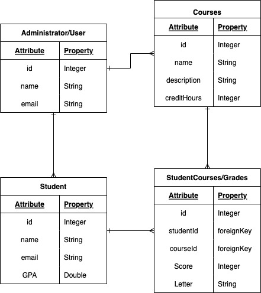

# GradeBook (backend)

A grade keeping app for teachers and administrators to manage their courses and students.

## Contributors

Aekangi Patel [Github](https://github.com/Aekangi) | [LinkedIn](https://www.linkedin.com/in/aekangipatel/)  
Philip Basnight [Github](https://github.com/phizbiz) | [LinkedIn](https://www.linkedin.com/in/philip-basnight/)  
Erwin Ortiz [Github](https://github.com/eortiz65) | [LinkedIn](https://www.linkedin.com/in/erwin-e-ortiz/)  
Josh Levine [Github](https://github.com/jadlevine) | [LinkedIn](https://www.linkedin.com/in/joshua-adam-levine/)  

## Date: 11/22/2022

## Overview

This application will allow you to add, view, update, and delete students, classes, and grades.

You can see our development progress on [Trello](https://trello.com/b/1ZcAdoVy/gradebook).

For more details about the frontend app, see the repository on [GitHub](https://github.com/jadlevine/gradebook-frontend).

## Screenshots of App

## Getting Started

- Create an account to keep track of your data.
- Add courses, and students using the links in the navigation bar.
- Check course details, including students enrolled, on the course details page.
- Check student details, including course list, and grades on the student details page.

## Technologies Used

- PostgreSQL + Sequelize
- Express.js
- React
- Node.js
- JavaScript

## Future Updates

- [ ] Enroll specific students in specific courses
- [ ] Update individual grades
- [ ] Implement Authorization
- [ ] Deploy on Heroku
